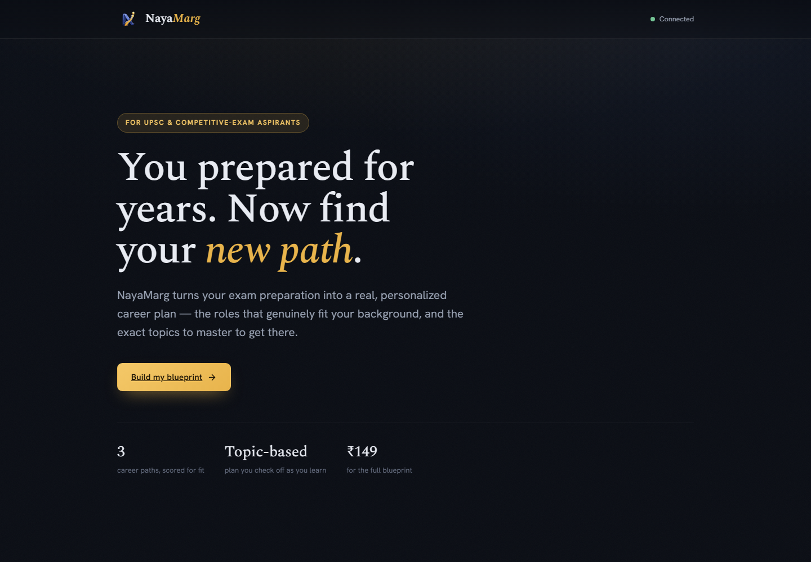
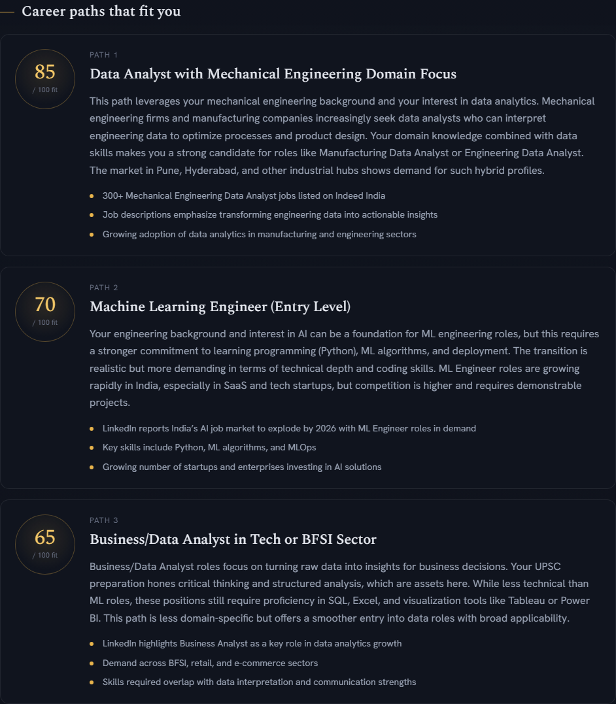
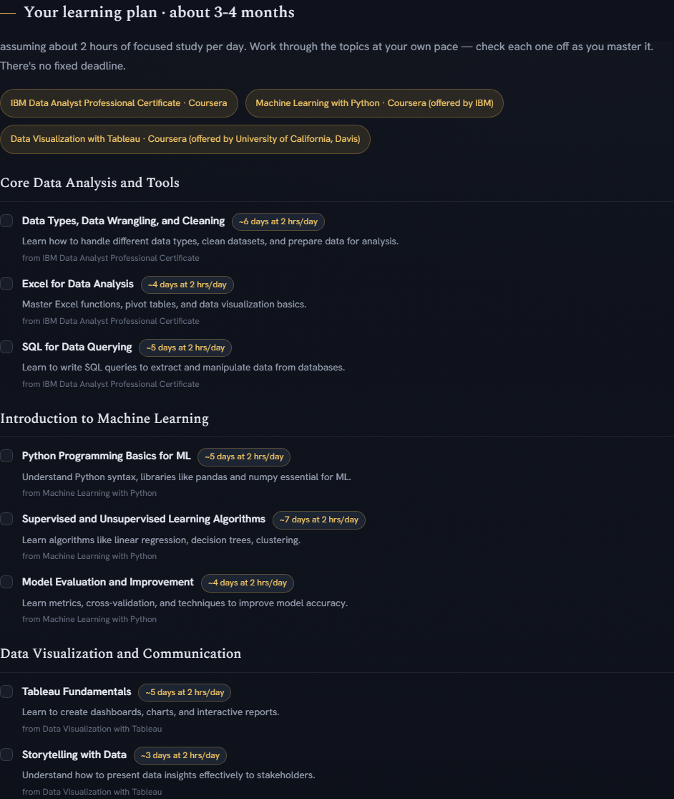

# NayaMarg

**NayaMarg** ("new path") helps UPSC and competitive-exam aspirants chart a realistic next chapter.

For candidates who spent years preparing for exams and are now weighing other directions, NayaMarg turns that hard-earned experience into a clear, personalized plan — mapping their strengths to careers that actually fit, and laying out the skills and steps to get there.

The long-term vision is a complete transition companion:

- a personalized career blueprint,
- an AI tutor that teaches the recommended skills,
- assessments to measure progress,
- and pathways into internships and jobs.

## A look inside

The landing experience:

Every blueprint recommends career paths scored for fit, grounded in live market research:

…and a realistic, topic-by-topic learning plan — real courses, honest time estimates, and progress tracked by what you complete rather than a countdown of days:

---

Built with Python and Next.js. In active early development.
